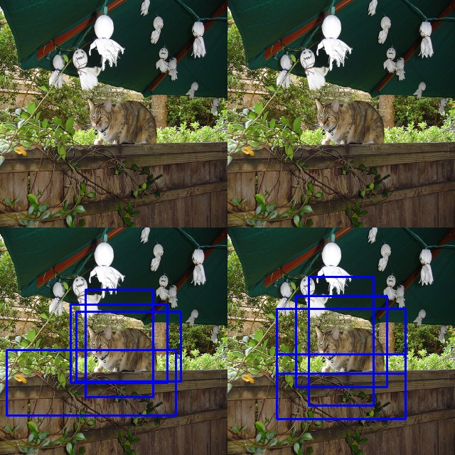
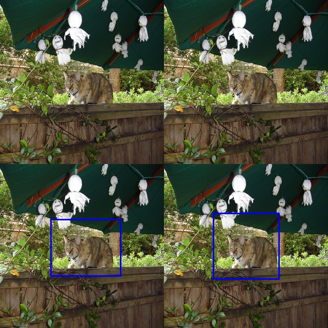
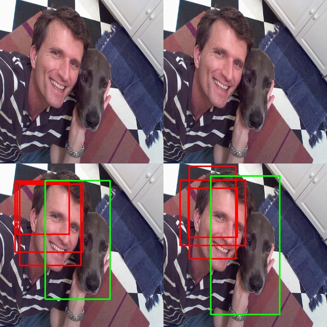
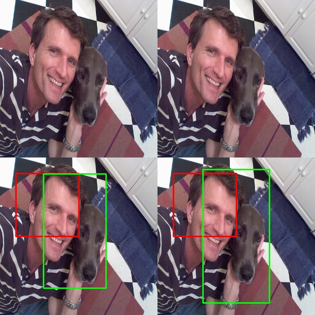
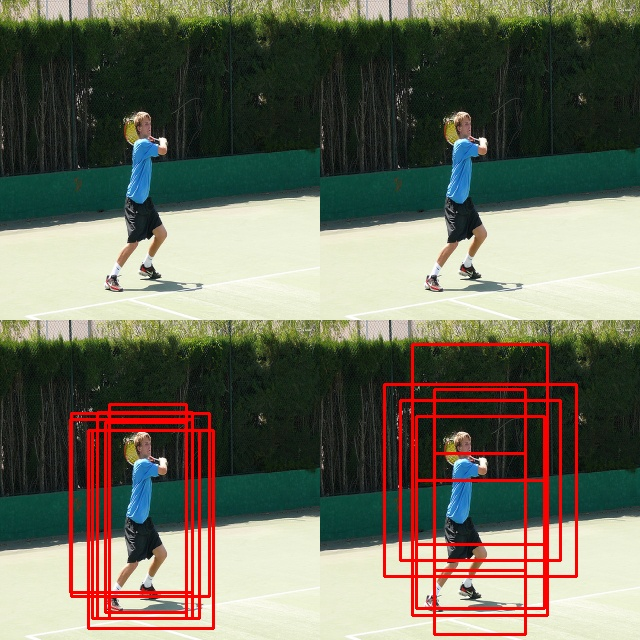
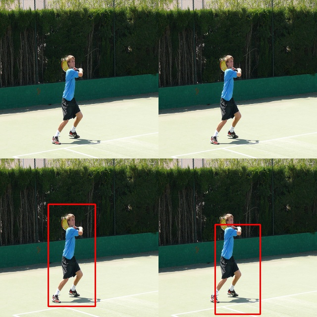
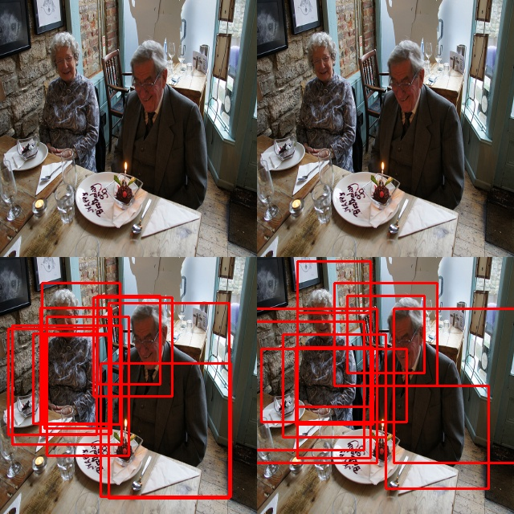
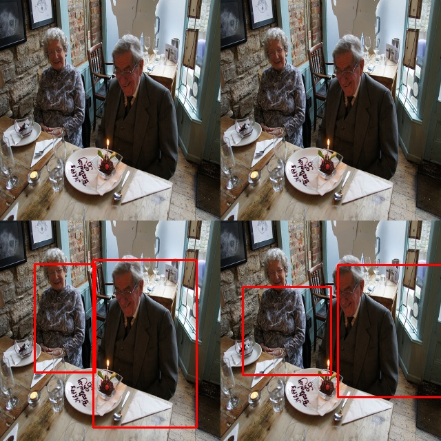

# Report: Assignment 3
## 1.Prediction of model on images from the test set
### 1.1 Results on image with one cat

### 1.2 Results on image with one dog  

### 1.3 Results on image with one person

### 1.4 Results on image with two persons

## 2.Hyperparameter settings
The hyperparameter settings are as follows. The learning rate is '1e-4', epoch number is '100', batch size is '32' and optimizer is 'Adam'.

## 3.Traning/Validation loss graphs
The below two pictures show different traning/validation loss graphs when applying softmax to confidence and not, respectively. The loss is pretty low without applying softmax, but the predicted results are not satisfying. The loss is relatively greater when applying softmax, but the predicted results are much better, which is why the submmitted results are the ones with softmax applied to confidence.

## 4. The F1 score calculated on the validation set (with precision and recall)
Separate.py is used to calculte precision, recall and F1 score on the dataset.
Although only the F1 score on validation set is required, the precision, recall and F1 scores on train set and whole dataset (including both train and validation set) are also shown as follows:

